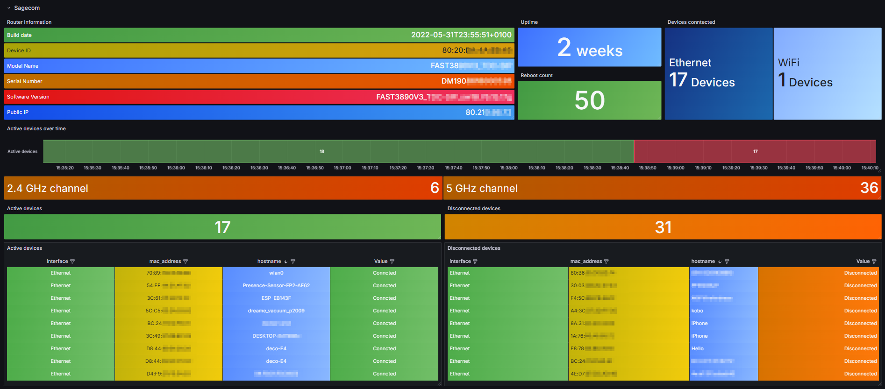
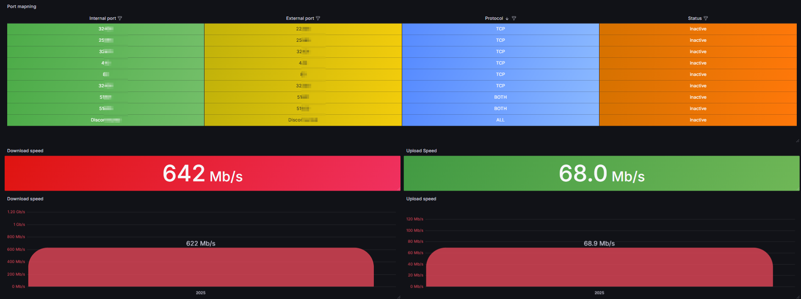
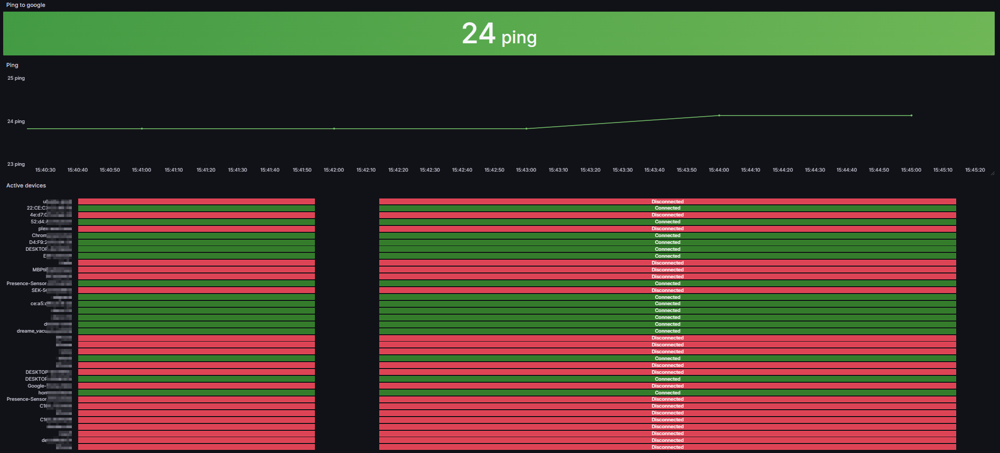

# Sagemcom Exporter

A **Prometheus exporter** for Sagemcom routers (often ISP-provided) to monitor:

- DHCP leases (connected/disconnected clients, MAC address, hostname, status)
- Router status (software version, build, model, uptime)
- WiFi channel info
- Port mapping (port forwarding rules, internal/external ports, protocol, status)
- Speedtest metrics (download/upload speeds)
- Ping metrics

Built on [python-sagemcom-api](https://github.com/iMicknl/python-sagemcom-api).  
Tested on **Sagemcom Fast 3890v3**, but may work on other models supported by `python-sagemcom-api`.

---

## Quick Start

1. **Clone this repository** (or use the `docker-compose.yml`).
```yaml
version: "3"
services:
  sagemcom_prometheus_exporter:
    image: ghcr.io/unknowlars/sagecom-exporter:latest
    container_name: sagemcom_prometheus_exporter
    environment:
      ROUTER_HOST: 192.168.0.1
      ROUTER_USERNAME: admin
      ROUTER_PASSWORD: Password
      COLLECTION_INTERVAL: 300
      SERVER_PORT: 8000
    ports:
      - 7000:8000
    volumes:
      - /etc/localtime:/etc/localtime:ro
```
3. **Update environment variables** in `docker-compose.yml`:
```
   environment:
     ROUTER_HOST: 192.168.0.1     # IP or hostname of your Sagemcom router
     ROUTER_USERNAME: admin       # Admin username
     ROUTER_PASSWORD: Password    # Admin password
     COLLECTION_INTERVAL: 300     # Frequency (in seconds) to collect metrics
     SERVER_PORT: 8000           # Port on which the exporter listens
```
3. **Start the exporter**:
   docker compose up -d

4. **Configure Prometheus** to scrape `http://<host>:7000/metrics`.
5. (Optional) **Import the provided Grafana dashboard** to visualize metrics.

---

## Usage

### Building Locally
```
git clone (https://github.com/Unknowlars/Sagecom-exporter.git) 
```
```
cd sagemcom-exporter
```
```
docker build -t sagemcom-exporter .  
```
```
docker run -d \
  --name sagecom_prometheus_exporter \
  -e ROUTER_HOST=192.168.0.1 \
  -e ROUTER_USERNAME=admin \
  -e ROUTER_PASSWORD=Password \
  -e COLLECTION_INTERVAL=300 \
  -e SERVER_PORT=8000 \
  -p 7000:8000 \
  -v /etc/localtime:/etc/localtime:ro \
  -v /etc/timezone:/etc/timezone:ro \
  ghcr.io/unknowlars/sagecom-exporter:latest

```
---

## Grafana Dashboard

Downlaod & Import `Sagecom-1736606124800.json` and select your promethues datasource

  
  


---

## Security Considerations

- Because this exporter connects to your router with admin credentials, ensure that it is not publicly exposed.
- Restrict access to the exporter’s port or run it behind a secure network.

---

## Credits

- Built on [python-sagemcom-api](https://github.com/iMicknl/python-sagemcom-api)

---

## License

[MIT License](./LICENSE)
